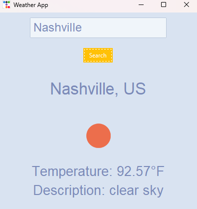
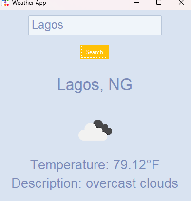

# Weather App

This Weather App is a simple application built with Python and the Tkinter library. Using a weather API, users can get the current weather information for a specified location.

## Table of Contents
- [Introduction](#introduction)
- [Features](#features)
- [Installation](#installation)
- [Usage](#usage)
- [Screenshots](#screenshots)
- [Contributing](#contributing)
- [License](#license)
- [Contact](#contact)

## Introduction
The Weather App is designed to provide users with real-time weather information for any location. It is built using Python and Tkinter, which provides a graphical user interface (GUI) for ease of use. The application fetches weather data from a weather API and displays it in a user-friendly format.

## Features
- Get current weather information for any city
- Displays temperature, humidity, and weather description
- Simple and intuitive GUI

## Installation
To run this Weather App on your local machine, follow these steps:

1. **Clone the Repository**:
    ```bash
    git clone https://github.com/1GW3M1CH3LL3/WeatherApp.git
    cd WeatherApp
    ```

2. **Set Up the Environment**:
    Ensure you have Python installed. You can download it from [python.org](https://www.python.org/).

3. **Install Required Libraries**:
    Install the necessary libraries using pip:
    ```bash
    pip install requests
    ```

4. **Get Your API Key**:
    Sign up at a weather API provider (e.g., [OpenWeatherMap](https://openweathermap.org/)) and get your API key.

5. **Configure the API Key**:
    - Open the `weather_app.py` file.
    - Replace the placeholder `YOUR_API_KEY` with your actual API key.

## Usage
To run the Weather App, execute the following command in the terminal:
```bash
python weather_app.py
```

1. Enter the city name where you want to get the weather information.
2. Click the "Search" button to fetch and display the weather data.

## Screenshots



## Contributing
Contributions are welcome! Feel free to create an issue or submit a pull request if you have suggestions for improvements or new features.


## Contact
If you have any questions or feedback, feel free to contact me at:

- **GitHub**: [1GW3M1CH3LL3](https://github.com/1GW3M1CH3LL3)
- **Email**: [adaoraigwe400@gmail.com]

---

